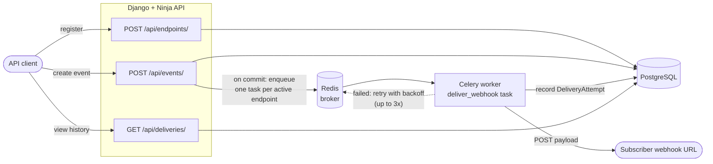

# Webhook Delivery Service

A small backend service that accepts events over HTTP and reliably fans
them out to registered webhook endpoints, with automatic retries and a
full delivery history. Built as a focused portfolio project — no
frontend, no authentication, no features beyond what's listed below.

## Stack

- Python 3.12
- Django 5 + [Django Ninja](https://django-ninja.dev/) (typed REST API)
- PostgreSQL (persistence)
- Celery + Redis (async delivery, retries)
- Docker / docker-compose

## Architecture



**Flow:**

1. A client registers one or more webhook endpoints (`WebhookEndpoint`).
2. A client submits an event (`Event`), identified by a caller-supplied
   `event_id`.
3. If `event_id` hasn't been seen before, the event is fanned out: one
   Celery task is enqueued per **active** endpoint, only after the
   database transaction that created the `Event` commits.
4. Each Celery task (`deliver_webhook`) POSTs the event as JSON to the
   endpoint and records the outcome as a `DeliveryAttempt` (status, HTTP
   status code, response time, attempt number).
5. On failure (non-2xx response, timeout, or connection error), the task
   retries up to 3 times with increasing delay (10s, 60s, 300s), each
   retry recorded as its own `DeliveryAttempt`.
6. `GET /api/deliveries/` exposes the full delivery history, filterable
   and paginated, for inspection/debugging.

## Data model

| Model             | Fields                                                                                          |
|--------------------|--------------------------------------------------------------------------------------------------|
| `WebhookEndpoint`  | `url`, `is_active`, `created_at`                                                                 |
| `Event`            | `event_id` (unique), `event_type`, `payload` (JSON), `created_at`                                |
| `DeliveryAttempt`  | `event` (FK), `endpoint` (FK), `status`, `http_status`, `response_time`, `attempt_number`, `error_message`, `created_at` |

`DeliveryAttempt.status` is one of the `DeliveryStatus` choices
(`webhooks/enums.py`): `success` or `failed`.

## Idempotency

`Event.event_id` is a unique column. Creating an event uses
`get_or_create(event_id=...)`: if the same `event_id` is submitted again,
no new `Event` row is created and **no new deliveries are scheduled** —
the API returns the existing event with HTTP 200 instead of 201 (the
status code alone tells the caller whether this was a fresh event or a
resubmission). This protects against duplicate processing when an
upstream producer retries an event submission.

## Retry behaviour

Retries are handled by Celery's own task retry mechanism:

- Each attempt is recorded independently, including `attempt_number`
  (1 = first try, 2-4 = retries).
- On failure, the task retries with a delay taken from
  `WEBHOOK_RETRY_DELAYS_SECONDS` (default `[10, 60, 300]` seconds).
- After 3 retries (4 attempts total) the task gives up; the last
  `DeliveryAttempt` row shows the final failure.
- "Failure" = a connection error/timeout, or an HTTP response outside
  the 2xx range.

Tunable via environment variables: `WEBHOOK_TIMEOUT_SECONDS` (per-request
timeout) and `WEBHOOK_MAX_RETRIES`.

## Pagination & filtering

`GET /api/deliveries/` is paginated with Django Ninja's built-in
`LimitOffsetPagination` (`?limit=&offset=`), returning
`{"items": [...], "count": <total>}`. Defaults and the max page size are
set globally in `config/settings.py`: `NINJA_PAGINATION_PER_PAGE = 50`,
`NINJA_PAGINATION_MAX_LIMIT = 200`.

It can also be filtered by `event_id`, `endpoint_id`, and/or `status`
(combined with AND), via a Django Ninja `FilterSchema`
(`webhooks/schemas/delivery.py`).

## Project layout

```
config/               Django project (settings, urls, celery app)
  api.py               NinjaAPI instance, wires up the routers below
webhooks/
  models.py            WebhookEndpoint, Event, DeliveryAttempt
  enums.py             DeliveryStatus choices
  services.py          send_webhook(): one HTTP delivery attempt
  tasks.py             deliver_webhook Celery task (retry orchestration)
  api/                 one router per resource
    endpoint.py          POST/GET /api/endpoints/
    event.py             POST /api/events/
    delivery.py          GET /api/deliveries/ (filters + pagination)
  schemas/             Django Ninja request/response/filter schemas
  tests/               unit tests
```

## Setup

Requires Docker and docker-compose.

```bash
cp .env.example .env
docker compose up --build
```

This starts PostgreSQL, Redis, the Django API (`http://localhost:8000`,
running migrations automatically on startup), and a Celery worker.

Interactive API docs (generated by Django Ninja) are available at
`http://localhost:8000/api/docs`.

### Running tests

```bash
docker compose run --rm web python manage.py test webhooks
```

## Example usage

Register a webhook endpoint:

```bash
curl -X POST http://localhost:8000/api/endpoints/ \
  -H "Content-Type: application/json" \
  -d '{"url": "https://example.com/webhooks/incoming", "is_active": true}'
```

List registered endpoints:

```bash
curl http://localhost:8000/api/endpoints/
```

Create an event (triggers async delivery to all active endpoints):

```bash
curl -X POST http://localhost:8000/api/events/ \
  -H "Content-Type: application/json" \
  -d '{
        "event_id": "evt-1001",
        "event_type": "order.created",
        "payload": {"order_id": 42, "total": 19.99}
      }'
```

Re-submitting the same `event_id` is a no-op (idempotent) and returns
HTTP 200 instead of 201, with no new deliveries scheduled:

```bash
curl -i -X POST http://localhost:8000/api/events/ \
  -H "Content-Type: application/json" \
  -d '{"event_id": "evt-1001", "event_type": "order.created", "payload": {}}'
```

View delivery history (filter by `event_id`, `endpoint_id`, and/or
`status`; paginate with `limit`/`offset`):

```bash
curl "http://localhost:8000/api/deliveries/?event_id=evt-1001&status=failed&limit=20"
```

## Out of scope

By design, to keep this a small, focused project: no authentication, no
frontend/UI, no endpoint signing/HMAC verification, no periodic tasks,
no admin site.
